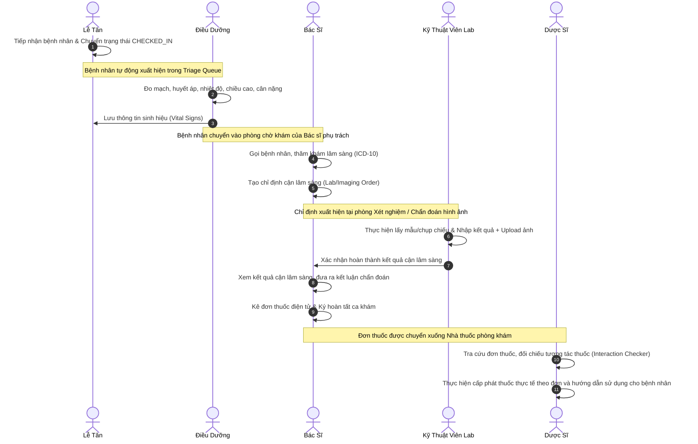

# TÀI LIỆU ĐẶC TẢ TÍNH NĂNG - PHÂN HỆ ADMIN WEB
## (Dành Cho Nhân Viên: Tiếp Tân, Điều Dưỡng, Bác Sĩ, Kỹ Thuật Viên, Dược Sĩ, Quản Trị Viên)

Tài liệu này mô tả chi tiết các chức năng, kiến trúc công nghệ và luồng nghiệp vụ hiện tại của hệ thống quản trị **Admin Web** thuộc dự án Hệ thống Quản Lý Phòng Khám Thông Minh (Smart Clinic Management System). Nội dung được biên soạn theo văn phong khoa học, cấu trúc chuẩn hóa để phục vụ trực tiếp cho báo cáo khóa luận, luận văn tốt nghiệp.

---

## 1. TỔNG QUAN VỀ PHÂN HỆ VÀ CÔNG NGHỆ SỬ DỤNG

Phân hệ **Admin Web** đóng vai trò là cổng thông tin nội bộ của phòng khám, cung cấp các công cụ tác nghiệp thời gian thực cho toàn bộ đội ngũ nhân viên y tế và quản lý.

*   **1.1. Công nghệ phát triển:**
    *   *Thư viện và Framework chính:* Sử dụng **ReactJS** kết hợp công cụ build **Vite** cho tốc độ phản hồi nhanh và tối ưu hóa hiệu năng giao diện.
    *   *Ngôn ngữ lập trình:* Sử dụng **TypeScript**, giúp chuẩn hóa các kiểu dữ liệu y khoa, hạn chế tối đa các lỗi runtime trong quá trình khám chữa bệnh.
    *   *Thiết kế giao diện:* Sử dụng **Tailwind CSS** kết hợp với bộ thư viện thành phần cao cấp **Shadcn UI** (xây dựng trên Radix UI Primitives) mang lại giao diện hiện đại, nhất quán.
    *   *Quản lý trạng thái:* Sử dụng **React Context API** kết hợp với **Local State** để quản lý dữ liệu cho các biểu mẫu tác nghiệp y khoa phức tạp.

---

## 2. CHI TIẾT CÁC PHÂN HỆ CHỨC NĂNG

### 2.1. Phân hệ Đăng nhập và Phân quyền Vai trò
*   **2.1.1. Xác thực người dùng:** Sử dụng giao thức đăng nhập bằng tài khoản nội bộ bao gồm tên tài khoản và mật khẩu. Sau khi xác thực thành công, hệ thống nhận mã thông báo **JWT (JSON Web Token)** từ Backend Spring Boot để lưu trữ và đính kèm vào tiêu đề của các yêu cầu API tiếp theo.
*   **2.1.2. Kiểm soát truy cập dựa trên vai trò (RBAC):**
    *   Hệ thống tự động nhận diện và phân quyền người dùng sau khi đăng nhập thành công. Các vai trò được phân định rõ ràng bao gồm: Quản trị viên (`ADMIN`), Bác sĩ (`DOCTOR`), Kỹ thuật viên (`LAB_TECH`) và Nhân viên (`STAFF`) (bao gồm cả lễ tân, điều dưỡng và dược sĩ).
    *   Tự động hiển thị hoặc ẩn các chức năng, menu trên thanh điều hướng tương ứng với từng quyền hạn.
    *   Bảo vệ các tuyến đường truy cập thông qua cơ chế Route Guards (thành phần `PrivateRoute.tsx`), ngăn chặn truy cập trái phép bằng cách nhập URL thủ công.

### 2.2. Phân hệ Bảng điều khiển Tổng quan
*   **2.2.1. Chỉ số đo lường nhanh:** Hiển thị các thông số thống kê tức thời trong ngày bao gồm số ca khám đã hoàn thành, số lịch hẹn đang chờ duyệt, số bệnh nhân đang thực hiện xét nghiệm lâm sàng và tổng doanh thu ước tính.
*   **2.2.2. Danh sách lịch khám gần đây:** Liệt kê các lịch hẹn mới đăng ký nhằm giúp nhân viên tiếp tân nhanh chóng cập nhật thông tin và xử lý hồ sơ.
*   **2.2.3. Thành phần hiện thực:** Giao diện chính được thiết lập qua thành phần **AdminDashboard.tsx**.

### 2.3. Phân hệ Quản lý Lịch hẹn
*   **2.3.1. Lịch biểu trực quan:** Giao diện lịch biểu (hiện thực qua **AppointmentCalendar.tsx**) hiển thị trực quan lịch làm việc của các phòng khám theo tuần hoặc tháng, hỗ trợ bộ phận tiếp tân sắp xếp ca trực của bác sĩ.
*   **2.3.2. Danh sách lịch hẹn:** Hỗ trợ tìm kiếm nhanh theo tên bệnh nhân, số điện thoại hoặc bác sĩ phụ trách. Bộ lọc đa tiêu chí cho phép lọc theo chuyên khoa, loại đặt lịch (`ONLINE` - Đặt trước qua web/app, `WALK_IN` - Khách đến trực tiếp) và trạng thái lịch hẹn (`PENDING` - Chờ duyệt, `CONFIRMED` - Đã xác nhận, `CHECKED_IN` - Đã tiếp nhận tại quầy, `CANCELLED` - Đã hủy). Hỗ trợ các thao tác nghiệp vụ như phê duyệt lịch hẹn, thay đổi trạng thái hoặc hủy lịch hẹn có ghi rõ lý do (thành phần **AppointmentList.tsx**).
*   **2.3.3. Danh sách tái khám:** Quản lý lịch hẹn tái khám của bệnh nhân, hỗ trợ nhân viên y tế chủ động liên hệ nhắc lịch và chuẩn bị hồ sơ bệnh án trước (thành phần **FollowUpList.tsx**).

### 2.4. Phân hệ Lâm sàng và Tiếp nhận Bệnh nhân
*   **2.4.1. Tiếp nhận và Đo chỉ số sinh hiệu:** Áp dụng cho nhân viên điều dưỡng khi bệnh nhân đã được tiếp nhận tại quầy (`CHECKED_IN`). Ghi nhận các chỉ số sinh tồn của bệnh nhân bao gồm mạch, nhiệt độ cơ thể, nhịp thở, huyết áp (tâm thu và tâm trương), chiều cao và cân nặng. Hệ thống tự động tính toán chỉ số khối cơ thể (**BMI**) và đưa ra phân loại trạng thái thể trạng (Gầy, Bình thường, Thừa cân, Béo phì) giúp hỗ trợ bác sĩ trong chẩn đoán (thành phần **TriageQueue.tsx** và **TriageWorkspace.tsx**).
*   **2.4.2. Hàng đợi khám của Bác sĩ:** Hiển thị danh sách bệnh nhân đã hoàn thành đo sinh hiệu, sắp xếp theo số thứ tự hàng đợi phòng khám để bác sĩ gọi vào phòng theo thứ tự (thành phần **ActiveVisits.tsx**).
*   **2.4.3. Không gian làm việc của Bác sĩ:**
    *   *Xem chỉ số sinh hiệu:* Bác sĩ xem nhanh thông tin hành chính, lý do khám và các chỉ số sinh hiệu do điều dưỡng đo đạc (thành phần **ConsultationWorkspace.tsx**).
    *   *Bệnh án điện tử (EMR):* Nhập chẩn đoán lâm sàng, mô tả triệu chứng cơ năng, kết quả khám thực thể. Tích hợp bộ mã hóa bệnh tật quốc tế **ICD-10** hỗ trợ tìm kiếm và quy chuẩn hóa mã bệnh.
    *   *Chỉ định dịch vụ cận lâm sàng:* Chọn nhanh các dịch vụ cận lâm sàng cần thiết như xét nghiệm máu, siêu âm, X-quang.
    *   *Kê đơn thuốc điện tử:* Tra cứu thuốc trong danh mục dược phẩm của hệ thống phòng khám, chỉ định số lượng, liều dùng (sáng, trưa, chiều, tối) và các ghi chú sử dụng thuốc (uống trước hay sau bữa ăn).
*   **2.4.4. Lịch sử hồ sơ bệnh án:** Cho phép bác sĩ truy xuất toàn bộ lịch sử khám chữa bệnh của bệnh nhân để đưa ra phác đồ điều trị nhất quán và chính xác (thành phần **MedicalRecordsList.tsx** và **MedicalRecordDetail.tsx**).

### 2.5. Phân hệ Cận lâm sàng và Xét nghiệm
*   **2.5.1. Danh sách chỉ định:** Hiển thị danh sách các chỉ định dịch vụ cận lâm sàng từ phòng khám của bác sĩ chuyển sang phòng kỹ thuật (thành phần **ServiceOrders.tsx**).
*   **2.5.2. Cập nhật kết quả xét nghiệm:** Kỹ thuật viên nhập kết quả đo đạc thực tế, ghi nhận mô tả chi tiết và đưa ra kết luận chuyên môn. Hỗ trợ tải lên hình ảnh kết quả chụp chiếu (X-quang, siêu âm, nội soi) hoặc tệp PDF kết quả xét nghiệm tổng hợp. Kết quả sau khi lưu sẽ ngay lập tức được đồng bộ và hiển thị trên màn hình làm việc của bác sĩ điều trị (thành phần **LabResults.tsx** và **LabResultDetail.tsx**).

### 2.6. Phân hệ Dược và Quản lý Nhà thuốc
*   **2.6.1. Cấp phát đơn thuốc:** Dược sĩ tiếp nhận đơn thuốc đã được bác sĩ ký số và hoàn tất trên hệ thống. Giao diện hiển thị chi tiết đơn thuốc bao gồm tên thuốc, liều lượng, số lượng thực tế cần cấp phát và hướng dẫn sử dụng. Đồng thời hỗ trợ in đơn thuốc trực tiếp hoặc xuất tệp PDF làm căn cứ bàn giao thuốc cho bệnh nhân (thành phần **PrescriptionDispense.tsx** và **PrescriptionDetail.tsx**).
*   **2.6.2. Danh mục dược phẩm:** Quản lý thông tin các loại thuốc lưu hành trong phòng khám bao gồm tên thương mại, tên hoạt chất, quy cách đóng gói, đơn vị tính, cách dùng mặc định, hỗ trợ thêm mới, cập nhật hoặc ngừng lưu hành thuốc (thành phần **MedicineInventory.tsx**).
*   **2.6.3. Hệ thống kiểm tra tương tác thuốc:** Tính năng chuyên môn hỗ trợ bác sĩ và dược sĩ kiểm tra tương tác khi phối hợp thuốc. Hệ thống đối chiếu cơ sở dữ liệu tương tác giữa các cặp hoạt chất để đưa ra cảnh báo chi tiết về **cơ chế tác động**, **hậu quả lâm sàng**, và **khuyến cáo xử lý** cụ thể, hạn chế tối đa tai biến y khoa (thành phần **DrugInteractionChecker.tsx**).

### 2.7. Phân hệ Quản lý Khách hàng và Đánh giá Dịch vụ
*   **2.7.1. Đánh giá chất lượng dịch vụ:** Tập hợp các đánh giá bằng số sao (từ 1 đến 5 sao) và phản hồi chi tiết từ bệnh nhân sau khi kết thúc ca khám, hỗ trợ cải thiện chất lượng dịch vụ (thành phần **Feedbacks.tsx**).
*   **2.7.2. Quản lý thông báo:** Công cụ tạo và gửi thông báo nhắc lịch hẹn, lịch tái khám hoặc thông tin chương trình chăm sóc sức khỏe cộng đồng của phòng khám (thành phần **Notifications.tsx**).

### 2.8. Phân hệ Cấu hình Danh mục Hệ thống
*   **2.8.1. Quản lý biểu phí bác sĩ:** Thiết lập đơn giá khám bệnh cụ thể cho từng bác sĩ dựa trên học hàm, học vị và chuyên môn chuyên sâu (thành phần **DoctorPricing.tsx**).
*   **2.8.2. Cấu hình chuyên khoa:** Thiết lập và quản lý danh mục các chuyên khoa hiện có tại phòng khám như Khoa Nội, Khoa Ngoại, Nhi khoa, v.v. (thành phần **ExpertiseSettings.tsx**).
*   **2.8.3. Cấu hình dịch vụ kỹ thuật:** Định nghĩa danh mục các dịch vụ xét nghiệm, chẩn đoán hình ảnh kèm đơn giá dịch vụ tương ứng (thành phần **ServiceCatalog.tsx**).
*   **2.8.4. Cấu hình thông tin phòng khám:** Cập nhật tên phòng khám, địa chỉ, hotline liên hệ, giờ mở cửa/đóng cửa và logo thương hiệu (thành phần **GeneralSettings.tsx**).
*   **2.8.5. Quản lý nhân sự và lịch nghỉ phép:** Hỗ trợ quản trị viên thêm mới tài khoản nhân viên y tế, phân quyền truy cập hệ thống và cập nhật thông tin cá nhân. Hỗ trợ phê duyệt yêu cầu nghỉ phép của nhân sự. Lịch nghỉ sau khi được phê duyệt sẽ tự động đồng bộ hóa để khóa các khung giờ đặt lịch của nhân sự đó trên ứng dụng của bệnh nhân (thành phần **StaffList.tsx** và **LeaveRequests.tsx**).

---

## 3. LUỒNG NGHIỆP VỤ LIÊN THÔNG NỘI BỘ

### 3.1. Sơ đồ phối hợp xử lý (Sequence Diagram)

### 3.2. Mô tả luồng xử lý chi tiết phục vụ báo cáo

Khi bệnh nhân đến phòng khám trực tiếp, quy trình làm việc liên thông giữa các phòng ban được diễn ra theo các bước sau:

*   **3.2.1. Bước 1 - Tiếp đón (Bộ phận Lễ tân):** Nhân viên lễ tân tiếp nhận bệnh nhân tại quầy, kiểm tra thông tin lịch đặt trước hoặc tạo lịch khám trực tiếp, sau đó chuyển trạng thái lịch hẹn sang **CHECKED_IN**. Lúc này, bệnh nhân được xếp vào hàng đợi đo sinh hiệu của Điều dưỡng.
*   **3.2.2. Bước 2 - Đo sinh hiệu (Bộ phận Điều dưỡng):** Điều dưỡng gọi bệnh nhân vào phòng đo đạc chỉ số sinh tồn (mạch, huyết áp, nhiệt độ, cân nặng, chiều cao), nhập các thông tin này lên hệ thống thông qua giao diện **TriageWorkspace.tsx**. Hệ thống tự động tính toán chỉ số khối cơ thể (**BMI**). Sau khi lưu, thông tin được gửi tới hàng đợi khám của Bác sĩ.
*   **3.2.3. Bước 3 - Khám lâm sàng và Chỉ định (Bác sĩ điều trị):** Bác sĩ gọi bệnh nhân vào phòng khám theo số thứ tự. Bác sĩ kiểm tra sinh hiệu, tiến hành khám lâm sàng, ghi nhận chẩn đoán theo mã quốc tế **ICD-10**. Nếu cần thực hiện các dịch vụ kỹ thuật, bác sĩ sẽ tạo chỉ định cận lâm sàng trên hệ thống.
*   **3.2.4. Bước 4 - Thực hiện cận lâm sàng (Kỹ thuật viên):** Chỉ định của bác sĩ xuất hiện tại phòng xét nghiệm hoặc phòng chẩn đoán hình ảnh tương ứng. Kỹ thuật viên tiến hành lấy mẫu hoặc chụp chiếu cho bệnh nhân, sau đó nhập kết quả đo đạc cùng hình ảnh kết quả lên hệ thống để trả kết quả về phòng bác sĩ.
*   **3.2.5. Bước 5 - Kết luận và Kê đơn (Bác sĩ điều trị):** Bác sĩ nhận kết quả cận lâm sàng, đưa ra chẩn đoán xác định và hướng điều trị, tiến hành kê đơn thuốc điện tử, sau đó ký xác nhận hoàn thành ca khám. Thông tin đơn thuốc được chuyển tự động đến phân hệ nhà thuốc.
*   **3.2.6. Bước 6 - Cấp phát thuốc (Dược sĩ):** Dược sĩ tiếp nhận đơn thuốc trên hệ thống, sử dụng công cụ kiểm tra tương tác thuốc để rà soát an toàn dược lâm sàng. Sau khi đối chiếu chính xác, dược sĩ in đơn thuốc, tiến hành phát thuốc thực tế và hướng dẫn bệnh nhân cách sử dụng.
