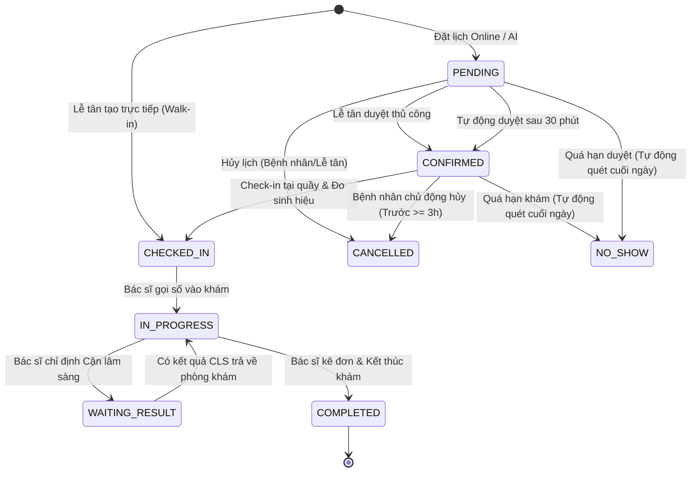
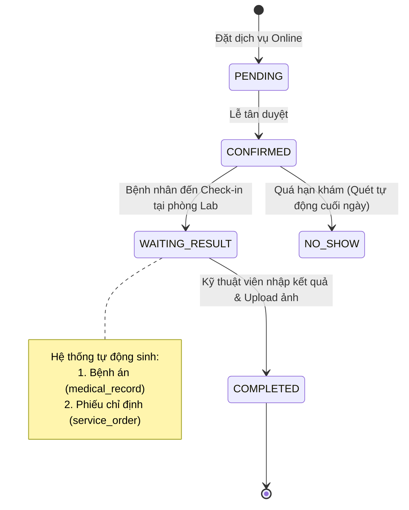
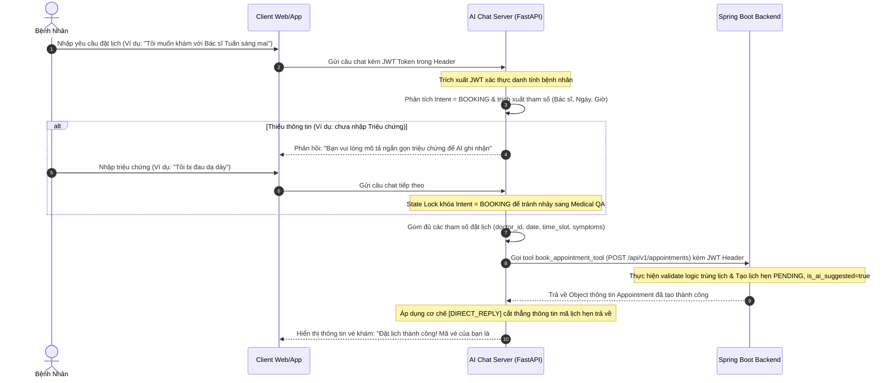

# Quy Trình Chuyển Đổi Trạng Thái Lịch Hẹn & Quy Tắc Tự Động Hóa

Tài liệu này đặc tả chi tiết quy trình quản lý vòng đời trạng thái của Lịch hẹn khám lâm sàng (Clinical Exam) và Lịch hẹn dịch vụ kỹ thuật (Service/Lab Test), bao gồm các quy tắc tự động hóa và xử lý ngoại lệ trên hệ thống.

---

## 1. Định Nghĩa Các Trạng Thái Lịch Hẹn (Appointment Statuses)

Hệ thống quản lý lịch hẹn qua các trạng thái cơ bản sau:
*   `PENDING` (Chờ duyệt): Lịch hẹn trực tuyến do bệnh nhân đặt từ Web/App hoặc trợ lý AI, đang chờ lễ tân xác nhận.
*   `CONFIRMED` (Đã xác nhận): Lịch hẹn đã được xác nhận (bởi nhân viên hoặc tự động bởi hệ thống). Slot khám được khóa chắc chắn.
*   `CHECKED_IN` (Đã tiếp nhận): Bệnh nhân đã đến phòng khám, được lễ tân check-in và đo sinh hiệu (vital signs).
*   `IN_PROGRESS` (Đang khám): Bác sĩ đã gọi số thứ tự và bệnh nhân đang trong phòng khám thực hiện chẩn đoán.
*   `WAITING_RESULT` (Chờ kết quả): Bệnh nhân đang đi thực hiện các chỉ định cận lâm sàng (xét nghiệm, siêu âm) và chờ trả kết quả về cho bác sĩ.
*   `COMPLETED` (Hoàn thành): Ca khám hoàn tất, bác sĩ đã kê đơn thuốc và lưu bệnh án điện tử (EMR).
*   `CANCELLED` (Đã hủy): Lịch hẹn bị hủy bởi bệnh nhân hoặc nhân viên phòng khám.
*   `NO_SHOW` (Vắng mặt): Bệnh nhân không đến phòng khám theo đúng lịch hẹn đã xác nhận.

---

## 2. Quy Trình Trạng Thái Lịch Hẹn Khám Lâm Sàng (Clinical Exam)

Luồng chuyển đổi trạng thái đối với lịch hẹn khám bệnh thông thường được mô tả qua sơ đồ dưới đây:



### Quy tắc xử lý và Tự động hóa:
1.  **Tự động duyệt sau 30 phút:** 
    *   *Nguyên nhân:* Để tránh việc nhân viên lễ tân quên duyệt thủ công khiến bệnh nhân hoang mang hoặc làm kẹt các slot giờ khám.
    *   *Quy tắc:* Nếu lịch hẹn ở trạng thái `PENDING` sau 30 phút kể từ lúc tạo (`created_at`) mà chưa có tương tác duyệt từ nhân viên, hệ thống sẽ **tự động chuyển sang trạng thái `CONFIRMED`** và gửi tin nhắn/push notification thông báo xác nhận thành công cho bệnh nhân.
2.  **Tự động quét vắng mặt (NO_SHOW) cuối ngày:**
    *   *Nguyên nhân:* Bệnh nhân đặt lịch nhưng không đến khám thực tế làm lãng phí thời gian của bác sĩ.
    *   *Quy tắc:* Định kỳ vào cuối ngày (ví dụ: 20:00 hàng ngày), một background job sẽ quét toàn bộ các lịch hẹn trong ngày có trạng thái `PENDING` hoặc `CONFIRMED` mà chưa chuyển sang `CHECKED_IN`. Hệ thống sẽ tự động chuyển trạng thái của chúng sang `NO_SHOW` và đánh dấu `is_deleted = 1` để giải phóng lịch, đồng thời cộng 1 điểm cảnh báo spam vào hồ sơ bệnh nhân.

---

## 3. Quy Trình Trạng Thái Lịch Hẹn Dịch Vụ Kỹ Thuật (Service/Lab Test)

Dành cho trường hợp bệnh nhân chủ động đặt lịch thực hiện các dịch vụ cận lâm sàng độc lập (như chụp X-quang, siêu âm thai, xét nghiệm máu theo yêu cầu) mà không qua phòng khám tổng quát của bác sĩ.



### Quy tắc xử lý đặc thù:
*   **Khi Check-in tại phòng Lab:** Trạng thái chuyển thẳng từ `CONFIRMED` sang `WAITING_RESULT`. Lúc này, hệ thống sẽ tự động khởi tạo hồ sơ bệnh án (`medical_record` với trạng thái `WAITING_RESULT`) và tự động tạo phiếu dịch vụ chỉ định (`service_order` ở trạng thái `ORDERED`) tương ứng với dịch vụ bệnh nhân đã đặt.
*   **Khi trả kết quả:** Kỹ thuật viên nhập số liệu và tải ảnh lên hệ thống, chuyển trạng thái `service_order` sang `DONE`. Lịch hẹn tự động chuyển sang `COMPLETED`.

---

## 4. Luồng Đặt Lịch Khám Tự Động Qua Trợ Lý AI (AI Booking Workflow)

Bên cạnh việc tự điền biểu mẫu, bệnh nhân có thể đặt lịch khám nhanh chóng thông qua hội thoại tự nhiên với Trợ lý AI trên Web/App. Quy trình tương tác và trao đổi dữ liệu giữa các phân hệ diễn ra như sau:



### Các quy tắc xử lý logic AI Booking:
*   **Xác thực thông tin qua JWT:** AI Chat Server (FastAPI) không yêu cầu bệnh nhân nhập lại tên hay số điện thoại. Nó trích xuất trực tiếp `patientId` và `accountId` từ JWT Token gửi kèm trong HTTP Header của phiên chat để làm việc với Java Backend.
*   **Tránh chuyển Intent giữa chừng (State Lock):** Khi người dùng đang ở giữa luồng đặt lịch và mô tả triệu chứng (ví dụ: "tôi bị đau bụng"), AI thường dễ bị nhầm sang Intent tư vấn sức khỏe (`MEDICAL_QA`). Hệ thống áp dụng cơ chế khóa trạng thái (State Lock) để bắt buộc giữ luồng đặt lịch cho đến khi hoàn tất.
*   **Cơ chế `[DIRECT_REPLY]` hiển thị thông tin:** Để tránh việc mô tả thành công từ backend bị LLM viết lại lung tung làm mất mã vé khám, hệ thống cắt thẳng phản hồi thành công từ backend và trả trực tiếp cho giao diện chat của người dùng.

---

## 5. Giải Pháp Kiến Trúc Tự Động Hóa Đề Xuất (Backend Schedulers)

Để hiện thực hóa hai quy tắc tự động hóa trên mà không làm ảnh hưởng đến hiệu năng hệ thống, chúng ta đề xuất xây dựng các scheduler ngầm (Spring Boot `@Scheduled`):

### 4.1. Scheduler duyệt tự động sau 30 phút (`AutoApproveScheduler`)
*   **Tần suất:** Chạy 5 phút một lần.
*   **Logic xử lý:**
    ```java
    LocalDateTime threshold = LocalDateTime.now().minusMinutes(30);
    List<Appointment> pendingList = appointmentRepository
        .findByStatusAndCreatedAtBeforeAndIsDeleted(AppointmentStatus.PENDING, threshold, 0);
    
    for (Appointment app : pendingList) {
        app.setStatus(AppointmentStatus.CONFIRMED);
        appointmentRepository.save(app);
        // Gửi thông báo đến tài khoản bệnh nhân
        notificationService.createAndSendNotification(
            app.getPatient().getAccount().getAccountId(),
            "Lịch hẹn của bạn đã được xác nhận tự động sau 30 phút chờ duyệt.",
            "SYSTEM"
        );
    }
    ```

### 4.2. Scheduler dọn dẹp vắng mặt cuối ngày (`NoShowCleanupScheduler`)
*   **Tần suất:** Chạy lúc 20:00 hàng ngày.
*   **Logic xử lý:**
    ```java
    LocalDate today = LocalDate.now();
    List<Appointment> leftPending = appointmentRepository
        .findByAppointmentDateAndStatusInAndIsDeleted(today, List.of(AppointmentStatus.PENDING, AppointmentStatus.CONFIRMED), 0);
        
    for (Appointment app : leftPending) {
        app.setStatus(AppointmentStatus.NO_SHOW);
        app.setCancelReason("Hệ thống tự động hủy do bệnh nhân vắng mặt (No-Show)");
        // Giải phóng slot giờ trong database để cho phép tái sử dụng
        app.setIsDeleted(1); 
        appointmentRepository.save(app);
    }
    ```
