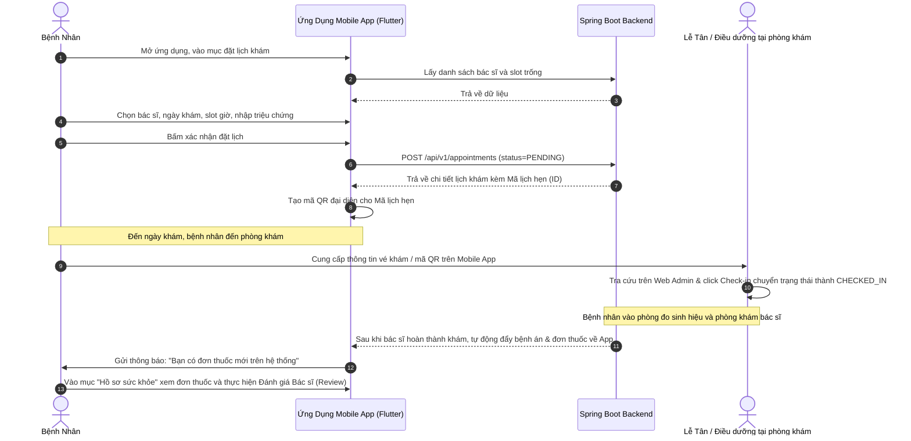

# TÀI LIỆU ĐẶC TẢ TÍNH NĂNG - PHÂN HỆ MOBILE APP
## (Dành Cho Bệnh Nhân Trên Nền Tảng Di Động)

Tài liệu này mô tả chi tiết các chức năng, kiến trúc công nghệ và luồng nghiệp vụ hiện tại của phân hệ **Mobile App** thuộc dự án Hệ thống Quản Lý Phòng Khám Thông Minh (Smart Clinic Management System). Nội dung được thiết kế theo văn phong khoa học, cấu trúc chặt chẽ để phục vụ trực tiếp cho báo cáo khóa luận, luận văn tốt nghiệp.

---

## 1. TỔNG QUAN VỀ PHÂN HỆ VÀ CÔNG NGHỆ SỬ DỤNG

Phân hệ **Mobile App** là ứng dụng di động đa nền tảng dành riêng cho bệnh nhân, giúp tối ưu hóa trải nghiệm tự phục vụ y tế từ xa và trực tiếp tại phòng khám. Ứng dụng cho phép bệnh nhân chủ động đặt lịch khám, theo dõi hồ sơ sức khỏe cá nhân, sử dụng vé khám điện tử tích hợp mã QR và tương tác trực tiếp với Trợ lý AI.

*   **1.1. Công nghệ phát triển:**
    *   *Framework chính:* Sử dụng **Flutter** (SDK mã nguồn mở do Google phát triển, cho phép biên dịch mã nguồn sang ứng dụng gốc chạy trên cả iOS và Android).
    *   *Ngôn ngữ lập trình:* Sử dụng **Dart**.
    *   *Quản lý trạng thái (State Management):* Sử dụng kiến trúc **Provider** giúp tách biệt lớp giao diện (UI) và logic nghiệp vụ xử lý dữ liệu (Business Logic), nâng cao khả năng bảo trì và kiểm thử mã nguồn.
    *   *Lưu trữ dữ liệu cục bộ:* Sử dụng thư viện bảo mật cục bộ của Flutter để lưu trữ thông tin cấu hình và mã thông báo xác thực **JWT (JSON Web Token)** một cách an sau.

---

## 2. CHI TIẾT CÁC PHÂN HỆ CHỨC NĂNG

### 2.1. Phân hệ Khởi chạy và Trang chủ
*   **2.1.1. Màn hình khởi chạy:** Hiển thị logo thương hiệu của phòng khám và tiến hành kiểm tra tự động trạng thái đăng nhập của người dùng. Nếu mã thông báo JWT còn hiệu lực, hệ thống tự động điều hướng vào trang chủ; ngược lại, người dùng sẽ được chuyển tới màn hình đăng nhập. Thành phần này được hiện thực qua `splash_screen.dart`.
*   **2.1.2. Màn hình chính:** Thanh điều hướng dưới cùng (Bottom Navigation Bar) gồm 5 tab chức năng chính bao gồm Trang chủ, Quản lý lịch hẹn, Trợ lý AI, Hồ sơ sức khỏe cá nhân và Cài đặt tài khoản. Thành phần này được hiện thực qua `main_screen.dart`.
*   **2.1.3. Banner nhắc nhở lịch khám sắp tới:** Hiển thị thông tin chi tiết về lịch khám gần nhất của bệnh nhân (bác sĩ phụ trách, chuyên khoa, thời gian khám) ngay trên đầu trang chủ để nhắc nhở người dùng.
*   **2.1.4. Lối tắt tiện ích (Quick Shortcuts):** Các nút truy cập nhanh đến các tính năng cốt lõi bao gồm Đặt lịch khám mới, trò chuyện với Trợ lý AI, xem đơn thuốc gần nhất và xem kết quả xét nghiệm.

### 2.2. Phân hệ Đặt lịch và Quản lý Lịch hẹn
*   **2.2.1. Quy trình đặt lịch khám trực quan:**
    *   *Chọn bác sĩ* (hiển thị qua `select_doctor_screen.dart`): Hiển thị danh sách bác sĩ kèm theo học hàm, chuyên khoa, biểu phí khám bệnh, hỗ trợ lọc theo khoa và tìm kiếm bác sĩ theo tên.
    *   *Chọn thời gian khám* (hiển thị qua `select_time_screen.dart`): Giao diện chọn ngày khám (Calendar Picker) hiển thị trực quan các ngày làm việc của bác sĩ. Sau khi chọn ngày, hệ thống tải danh sách các khung giờ trống (mỗi khung giờ kéo dài 30 phút) để bệnh nhân lựa chọn.
    *   *Xác nhận đặt lịch* (hiển thị qua `confirm_booking_screen.dart`): Bệnh nhân điền thông tin mô tả chi tiết triệu chứng hoặc lý do khám bệnh và nhấn xác nhận để gửi yêu cầu đặt lịch lên hệ thống.
*   **2.2.2. Danh sách lịch hẹn:** Phân loại lịch hẹn thành ba trạng thái rõ ràng bao gồm Lịch hẹn sắp tới (**Upcoming**), Lịch sử khám bệnh (**Past**) và Lịch hẹn đã hủy (**Cancelled**) để người dùng tiện theo dõi. Thành phần này được hiện thực qua `appointment_screen.dart`.
*   **2.2.3. Màn hình chi tiết lịch hẹn và Vé điện tử:** Hiển thị đầy đủ thông tin về phòng khám, địa chỉ, bác sĩ phụ trách, thời gian cụ thể và hướng dẫn chuẩn bị trước khi khám. Tích hợp mã **QR** tự động sinh từ mã số lịch hẹn của bệnh nhân, đóng vai trò là Vé khám điện tử giúp lễ tân Check-in trực tiếp mà không cần làm thủ tục giấy tờ phiền hà (thành phần `appointment_detail_screen.dart`).
*   **2.2.4. Thay đổi lịch khám:** Cho phép bệnh nhân chủ động dời ngày hoặc giờ khám trực tiếp trên lịch hẹn có sẵn (nếu khung giờ mới còn trống), tránh việc phải hủy lịch hẹn cũ và tạo lịch hẹn mới (thành phần `reschedule_dialog.dart`).
*   **2.2.5. Đánh giá Bác sĩ:** Sau khi ca khám hoàn thành và trạng thái lịch hẹn chuyển sang `COMPLETED`, ứng dụng hiển thị biểu mẫu để bệnh nhân chấm điểm mức độ hài lòng (từ 1 đến 5 sao) và viết phản hồi đóng góp ý kiến cho bác sĩ điều trị (thành phần `review_screen.dart`).

### 2.3. Phân hệ Trợ lý AI Tư vấn Y khoa Di động
*   **2.3.1. Giao diện hội thoại chuyên biệt:** Trải nghiệm trò chuyện trực quan qua bong bóng thoại với hiệu ứng mượt mà (bong bóng màu xanh dành cho bệnh nhân, bong bóng màu xám dành cho Trợ lý AI).
*   **2.3.2. Đặt lịch khám tự động qua trò chuyện:** Bệnh nhân chỉ cần nhắn tin mô tả tình trạng sức khỏe cho Trợ lý AI. Trợ lý AI sử dụng thông tin tài khoản đã đăng nhập của bệnh nhân (thông qua mã JWT đính kèm trong tiêu đề yêu cầu) để kiểm tra các khung giờ trống của bác sĩ phù hợp, sau đó thực hiện đặt lịch tự động và trả về mã lịch hẹn ngay trong khung chat cho người dùng mà không cần điền biểu mẫu thủ công.

### 2.4. Phân hệ Bệnh án Điện tử Cầm tay
*   **2.4.1. Lịch sử đợt khám:** Hiển thị dòng thời gian (Timeline) các lần khám chữa bệnh của bệnh nhân tại phòng khám theo thứ tự thời gian gần nhất (thành phần `records_screen.dart`).
*   **2.4.2. Chi tiết đợt khám:** Cho phép người dùng xem lại thông tin chẩn đoán xác định của bác sĩ, phương án điều trị, các chỉ số sinh hiệu đo được tại phòng khám và chi phí của ca khám (thành phần `record_detail_screen.dart`).
*   **2.4.3. Đơn thuốc điện tử:** Liệt kê chi tiết các thuốc được bác sĩ kê đơn bao gồm tên thuốc, hàm lượng, số lượng và hướng dẫn sử dụng chi tiết như uống vào buổi nào, liều lượng bao nhiêu, trước hay sau khi ăn (thành phần `prescription_screen.dart`).
*   **2.4.4. Báo cáo cận lâm sàng:** Cho phép bệnh nhân xem và tải các kết quả cận lâm sàng của mình bao gồm các chỉ số xét nghiệm (máu, nước tiểu) và hình ảnh chẩn đoán hình ảnh (X-quang, siêu âm, nội soi) được tải lên từ hệ thống của phòng khám (thành phần `lab_result_screen.dart`).

### 2.5. Phân hệ Cài đặt và Quản lý Hồ sơ cá nhân
*   **2.5.1. Trang quản lý hồ sơ và tài khoản:** Giao diện hiển thị tóm tắt thông tin tài khoản của bệnh nhân bao gồm họ tên, email, ảnh đại diện và vai trò hệ thống. Cung cấp menu lựa chọn truy cập nhanh các tính năng con và cài đặt bảo mật (thành phần `profile_screen.dart`).
*   **2.5.2. Chỉnh sửa thông tin cá nhân:** Cho phép bệnh nhân chỉnh sửa và cập nhật các thông tin hành chính cá nhân bao gồm họ tên, giới tính, ngày sinh, số điện thoại liên hệ và địa chỉ thường trú (thành phần `edit_profile_screen.dart`).
*   **2.5.3. Cập nhật chỉ số sinh hiệu và hồ sơ sức khỏe:** Cho phép bệnh nhân chủ động tự khai báo và cập nhật định kỳ các thông tin về thể trạng bao gồm chiều cao, cân nặng, nhóm máu, tiền sử dị ứng thuốc/thức ăn, các bệnh lý mãn tính và tiền sử gia đình nhằm giúp bác sĩ có góc nhìn tổng quan khi điều trị (thành phần `edit_medical_profile_screen.dart`).
*   **2.5.4. Đổi mật khẩu tài khoản:** Cung cấp biểu mẫu đổi mật khẩu bảo mật dưới dạng Bottom Sheet. Yêu cầu nhập mật khẩu hiện tại, mật khẩu mới và xác nhận mật khẩu mới để hệ thống mã hóa và lưu trữ cập nhật lên Backend.
*   **2.5.5. Đánh giá và Góp ý:** Cho phép bệnh nhân chấm điểm mức độ hài lòng và viết ý kiến góp ý phản hồi về dịch vụ chung của phòng khám hoặc về ứng dụng di động để ban quản lý tiếp nhận cải tiến (thành phần `feedback_screen.dart`).
*   **2.5.6. Lịch sử phản hồi:** Lưu trữ danh sách toàn bộ các đánh giá và phản hồi mà bệnh nhân đã gửi trước đó để người dùng dễ dàng theo dõi lại lịch sử tương tác (thành phần `review_history_screen.dart`).
*   **2.5.7. Trung tâm hỗ trợ và Câu hỏi thường gặp (FAQs):** Cung cấp các câu hỏi và câu trả lời soạn sẵn liên quan đến hướng dẫn khám chữa bệnh, chính sách bảo hiểm, quy trình đặt lịch hoặc hỗ trợ kỹ thuật (thành phần `faq_screen.dart`).
*   **2.5.8. Đăng xuất tài khoản:** Hiển thị Bottom Sheet xác nhận đăng xuất. Sau khi bệnh nhân xác nhận, hệ thống sẽ tiến hành xóa mã thông báo JWT lưu trữ cục bộ và đưa bệnh nhân trở lại màn hình đăng nhập.

### 2.6. Phân hệ Hộp thư Thông báo Hệ thống
*   **2.6.1. Quản lý thông báo:** Nhận các thông báo tự động (Push Notifications) từ phòng khám để nhắc lịch khám sắp diễn ra, thông báo đổi lịch hẹn từ bác sĩ hoặc thông báo nhắc tái khám (thành phần `notification_screen.dart`).

---

## 3. HÀNH TRÌNH NGƯỜI DÙNG ĐẶT LỊCH KHÁM & KHÁM BỆNH

### 3.1. Sơ đồ quy trình (Sequence Diagram)

### 3.2. Mô tả hành trình chi tiết phục vụ báo cáo

Quy trình sử dụng ứng dụng di động từ khi bệnh nhân ở nhà cho đến khi hoàn thành buổi khám tại phòng khám bao gồm các giai đoạn sau:

*   **3.2.1. Giai đoạn 1 - Đăng ký lịch khám trực tuyến:** Bệnh nhân mở ứng dụng di động Flutter trên điện thoại, truy cập vào chức năng đặt lịch. Ứng dụng gửi yêu cầu API đến Backend Spring Boot để tải danh sách bác sĩ và các khung giờ làm việc còn trống. Bệnh nhân thực hiện chọn bác sĩ mong muốn, chọn ngày khám, khung giờ khám và ghi nhận triệu chứng hiện tại, sau đó xác nhận. Hệ thống tạo lịch hẹn ở trạng thái **PENDING** và trả về mã số lịch hẹn.
*   **3.2.2. Giai đoạn 2 - Tạo vé khám điện tử:** Ứng dụng Flutter nhận thông tin lịch khám thành công và tự động tạo một mã QR tương ứng chứa mã số lịch hẹn. Mã QR này được hiển thị rõ ràng trên màn hình chi tiết lịch hẹn để bệnh nhân sử dụng khi đến phòng khám.
*   **3.2.3. Giai đoạn 3 - Tiếp đón tại phòng khám:** Khi đến ngày hẹn khám, bệnh nhân đến phòng khám và xuất trình mã QR trên ứng dụng cho nhân viên tiếp tân. Nhân viên lễ tân đối chiếu thông tin hoặc thực hiện thao tác tiếp nhận trên phần mềm Admin Web để chuyển trạng thái lịch hẹn sang **CHECKED_IN**, đồng thời xếp bệnh nhân vào hàng đợi đo sinh hiệu.
*   **3.2.4. Giai đoạn 4 - Đồng bộ thông tin sau khám:** Sau khi bệnh nhân trải qua các bước đo sinh hiệu, khám bác sĩ, thực hiện cận lâm sàng (nếu có) và nhận kết luận điều trị, bác sĩ xác nhận hoàn thành ca khám. Ngay lập tức, hệ thống Backend gửi thông báo đẩy (Push Notification) đến điện thoại của bệnh nhân. Bệnh nhân mở ứng dụng để xem chi tiết hồ sơ bệnh án điện tử, kết quả xét nghiệm và đơn thuốc được kê.
*   **3.2.5. Giai đoạn 5 - Đánh giá phản hồi:** Bệnh nhân nhận thuốc tại quầy dược và truy cập vào lịch sử lịch hẹn trên ứng dụng di động để thực hiện đánh giá mức độ hài lòng đối với bác sĩ điều trị và chất lượng dịch vụ của phòng khám.
