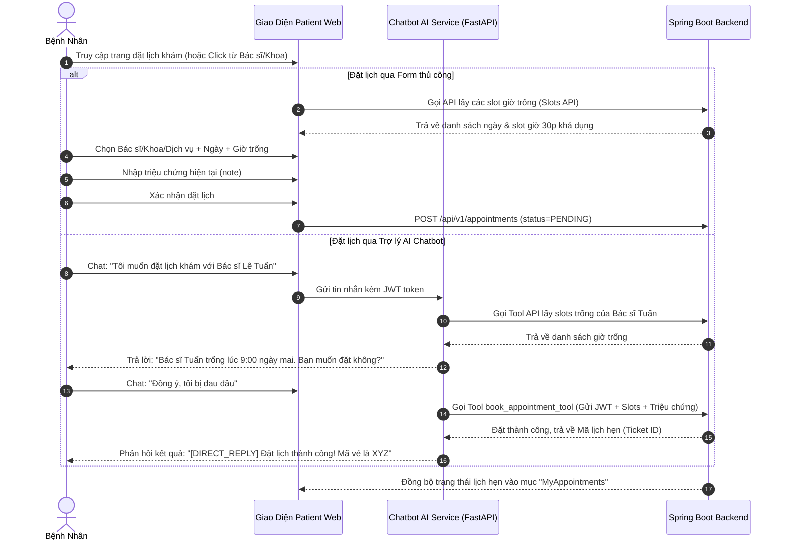

# TÀI LIỆU ĐẶC TẢ TÍNH NĂNG - PHÂN HỆ PATIENT WEB
## (Cổng Thông Tin & Dịch Vụ Dành Cho Bệnh Nhân)

Tài liệu này mô tả chi tiết các chức năng, kiến trúc công nghệ và luồng nghiệp vụ hiện tại của phân hệ **Patient Web** thuộc dự án Hệ thống Quản Lý Phòng Khám Thông Minh (Smart Clinic Management System). Nội dung được biên soạn theo văn phong khoa học, cấu trúc chuẩn hóa để phục vụ trực tiếp cho báo cáo khóa luận, luận văn tốt nghiệp.

---

## 1. TỔNG QUAN VỀ PHÂN HỆ VÀ CÔNG NGHỆ SỬ DỤNG

Phân hệ **Patient Web** đóng vai trò là cổng thông tin công cộng và không gian tương tác trực tuyến dành cho bệnh nhân. Hệ thống được tối ưu hóa giao diện hiển thị tốt trên cả máy tính (Desktop) và thiết bị di động (Responsive Web Design), giúp bệnh nhân dễ dàng tiếp cận các dịch vụ y khoa của phòng khám từ xa.

*   **1.1. Công nghệ phát triển:**
    *   *Thư viện và Framework chính:* Sử dụng **ReactJS** kết hợp công cụ build **Vite** cho tốc độ tải trang nhanh và hiệu năng hoạt động mượt mà.
    *   *Ngôn ngữ lập trình:* Sử dụng **TypeScript**, giúp chuẩn hóa và kiểm soát chặt chẽ dữ liệu trao đổi giữa máy khách và máy chủ.
    *   *Thiết kế giao diện:* Sử dụng **Tailwind CSS** kết hợp với bộ thư viện thành phần **Shadcn UI** và bộ thư viện biểu tượng **Lucide React** tạo nên phong cách thiết kế hiện đại, tinh tế.
    *   *Thành phần tương tác động:* Tích hợp bộ thư viện trượt (**Carousels**) hỗ trợ hiển thị sinh động danh mục chuyên khoa và đội ngũ bác sĩ.

---

## 2. CHI TIẾT CÁC PHÂN HỆ CHỨC NĂNG

### 2.1. Cổng Thông tin Công cộng
*   **2.1.1. Trình chiếu chuyên khoa (Specialty Carousel):** Hiển thị danh sách các chuyên khoa y tế của phòng khám dưới dạng thẻ trượt linh hoạt. Bệnh nhân có thể bấm vào chuyên khoa để xem thông tin chi tiết hoặc chuyển nhanh đến trang đặt lịch khám của chuyên khoa đó. Thành phần này được hiện thực qua `SpecialtyCarousel.tsx`.
*   **2.1.2. Danh sách bác sĩ tiêu biểu (Featured Doctors):** Giới thiệu các bác sĩ nổi bật kèm hình ảnh, học hàm, học vị, chuyên khoa phụ trách và liên kết nhanh đến lịch khám của riêng bác sĩ đó. Thành phần này được hiện thực qua `FeaturedDoctors.tsx`.
*   **2.1.3. Bảng giá dịch vụ công khai:** Danh mục chi tiết các dịch vụ khám bệnh và cận lâm sàng (xét nghiệm, siêu âm, chụp chiếu) kèm theo đơn giá minh bạch giúp bệnh nhân chủ động chuẩn bị tài chính.
*   **2.1.4. Trang liên hệ (Contact Page):** Cung cấp bản đồ vị trí phòng khám, số điện thoại hotline hỗ trợ, email tiếp nhận và biểu mẫu trực tuyến cho phép gửi các thắc mắc, phản hồi trực tiếp tới phòng khám.

### 2.2. Quy trình Đặt lịch khám Thông minh
Đây là chức năng cốt lõi của Patient Web, cho phép bệnh nhân đăng ký lịch hẹn trực tuyến linh hoạt thông qua **4 chế độ truy cập nghiệp vụ (Entry Modes)** tùy thuộc vào nhu cầu thực tế. Thành phần chính được hiện thực tại `BookAppointment.tsx`.
*   **2.2.1. Bốn chế độ truy cập nghiệp vụ bao gồm:**
    *   *Chế độ Đặt lịch theo Bác sĩ (DOCTOR Mode):* Bệnh nhân chủ động chọn bác sĩ mong muốn điều trị từ trang thông tin bác sĩ. Hệ thống sẽ cố định thông tin bác sĩ và chỉ hiển thị các khung giờ còn trống của riêng bác sĩ đó để bệnh nhân lựa chọn.
    *   *Chế độ Đặt lịch theo Chuyên khoa (EXPERTISE Mode):* Bệnh nhân chọn chuyên khoa cần khám (ví dụ Khoa Nhi, Khoa Nội). Hệ thống hiển thị danh sách các bác sĩ thuộc khoa đó. Bệnh nhân có thể chỉ định bác sĩ cụ thể hoặc để hệ thống tự động phân bổ ngẫu nhiên dựa trên các khung giờ làm việc còn trống trong khoa.
    *   *Chế độ Đặt lịch theo Dịch vụ (SERVICE Mode):* Sử dụng khi bệnh nhân có nhu cầu thực hiện trực tiếp một dịch vụ kỹ thuật cận lâm sàng (ví dụ chụp X-quang phổi, xét nghiệm máu tổng quát) mà không cần qua bước khám lâm sàng của bác sĩ tổng quát. Hệ thống sẽ kiểm tra và hiển thị các khung giờ trống của phòng kỹ thuật tương ứng.
    *   *Chế độ Đặt lịch trực tiếp (DIRECT Mode):* Dành cho bệnh nhân chưa xác định rõ triệu chứng của mình thuộc chuyên khoa nào. Bệnh nhân nhập mô tả triệu chứng sức khỏe, hệ thống (kết hợp với tính năng gợi ý chuyên khoa của AI) sẽ tự động phân tích và đề xuất chuyên khoa khám phù hợp nhất.
*   **2.2.2. Bộ chọn khung giờ thực tế (Real-time Slot Picker):** Chỉ hiển thị các ngày làm việc khả dụng của bác sĩ (tự động loại bỏ các ngày nghỉ phép hoặc các ngày bác sĩ đã đủ số lượng bệnh nhân tối đa). Khung giờ khám được chia nhỏ thành các khoảng thời gian 30 phút (ví dụ 08:00, 08:30,...). Các khung giờ đã được đặt chỗ trước hoặc trùng ca bận của bác sĩ sẽ được làm mờ và vô hiệu hóa trong thời gian thực.
*   **2.2.3. Ghi nhận lý do khám:** Bệnh nhân bắt buộc phải mô tả ngắn gọn triệu chứng sức khỏe hiện tại giúp bác sĩ chủ động nghiên cứu hồ sơ trước khi gặp bệnh nhân.

### 2.3. Cổng Cá nhân Bệnh nhân
*   **2.3.1. Xác thực và Đăng ký tài khoản:** Hỗ trợ đăng ký tài khoản bệnh nhân bằng số điện thoại hoặc email cá nhân, mã hóa mật khẩu và đăng nhập nhận mã thông báo JWT để truy cập an toàn vào kho dữ liệu y tế cá nhân. Thành phần này được hiện thực qua `LoginForm.tsx` và trang Register.
*   **2.3.2. Quản lý hồ sơ sức khỏe:** Hiển thị thông tin cá nhân cơ bản (họ tên, giới tính, ngày sinh, địa chỉ liên hệ và số thẻ Bảo hiểm Y tế) và biểu đồ các chỉ số sinh hiệu đo được từ lần khám gần nhất (mạch, huyết áp, cân nặng, chiều cao) cùng với chỉ số **BMI** tự động tính toán giúp bệnh nhân tự theo dõi thể trạng của bản thân (thành phần `HealthProfile.tsx`).
*   **2.3.3. Quản lý lịch hẹn cá nhân:**
    *   *Danh sách lịch hẹn:* Hiển thị danh sách toàn bộ lịch hẹn sắp tới (chờ khám) và lịch hẹn trong quá khứ (thành phần `MyAppointments.tsx`).
    *   *Chi tiết lịch hẹn:* Hiển thị chi tiết vé khám điện tử bao gồm mã số lịch hẹn, phòng khám chuyên khoa, bác sĩ đảm nhận và các chỉ dẫn y tế chuẩn bị trước khi khám (thành phần `AppointmentDetail.tsx`).
    *   *Quy tắc hủy lịch:* Cho phép bệnh nhân chủ động hủy lịch khám trực tuyến tối thiểu **3 tiếng** trước thời điểm khám đã đăng ký. Hệ thống thiết lập quy tắc giới hạn đặt lịch nếu bệnh nhân hủy lịch muộn hoặc không đến quá số lần quy định.
*   **2.3.4. Lịch sử khám chữa bệnh:**
    *   *Xem lịch sử điều trị chi tiết* gồm lý do khám, chẩn đoán của bác sĩ điều trị và hướng xử trí y khoa (thành phần `MyRecords.tsx` và `RecordDetail.tsx`).
    *   *Đơn thuốc điện tử:* Liệt kê chi tiết tên thuốc, hàm lượng, số lượng và liều lượng sử dụng được kê trong mỗi đợt khám (thành phần `Prescriptions.tsx`).
    *   *Kết quả cận lâm sàng:* Hiển thị chi tiết các chỉ số xét nghiệm sinh hóa và liên kết xem hình ảnh kết quả chẩn đoán hình ảnh (X-quang, siêu âm, nội soi) được tải lên từ phòng khám (thành phần `LabResults.tsx`).

### 2.4. Trợ lý AI Tư vấn và Đặt Lịch Tự Động
*   **2.4.1. Giao diện bong bóng chat (Chat Widget):** Tích hợp ở góc dưới bên phải màn hình Patient Web, có thể thu nhỏ hoặc phóng to linh hoạt để không ảnh hưởng đến không gian đọc tin tức của người dùng. Thành phần này hiện thực tại phân hệ chatbot.
*   **2.4.2. Công nghệ truyền dữ liệu thời gian thực:** Hội thoại sử dụng kỹ thuật truyền tải dữ liệu dạng luồng (**Server-Sent Events - SSE**) kết nối trực tiếp đến máy chủ AI (FastAPI), giúp câu trả lời của chatbot hiển thị dưới dạng gõ chữ từng ký tự mang lại trải nghiệm tương tác tự nhiên và phản hồi nhanh chóng.
*   **2.4.3. Các tính năng cốt lõi của Chatbot AI:**
    *   *Hỏi đáp thông tin phòng khám (FAQs):* Giải đáp tức thời các câu hỏi liên quan đến địa chỉ phòng khám, giờ làm việc, chi phí dịch vụ khám bệnh và các hướng dẫn thanh toán Bảo hiểm Y tế.
    *   *Tư vấn triệu chứng y khoa ban đầu:* Hỗ trợ phân tích triệu chứng do người bệnh cung cấp, tư vấn chuyên khoa phù hợp (không đưa ra chẩn đoán chính thức thay thế y lệnh bác sĩ).
    *   *Đồng đặt lịch khám tự động qua chat:* Chatbot hướng dẫn bệnh nhân cung cấp thông tin cần thiết, sau đó gọi công cụ tự động (`book_appointment_tool`) để tương tác với Backend Spring Boot và tạo lịch hẹn ở trạng thái **PENDING** trực tiếp trong phiên chat mà bệnh nhân không cần thao tác trên biểu mẫu đặt lịch.

---

## 3. LUỒNG NGHIỆP VỤ TỰ ĐẶT LỊCH KHÁM

### 3.1. Sơ đồ quy trình (Sequence Diagram)

### 3.2. Mô tả hành trình chi tiết phục vụ báo cáo

Hành trình đặt lịch khám trực tuyến của bệnh nhân trên phân hệ Patient Web được thiết kế theo hai luồng nghiệp vụ song song tùy thuộc vào phương thức tương tác:

*   **3.2.1. Nhánh A - Đặt lịch thông qua Biểu mẫu thủ công (Form Booking):**
    *   *Bước A1:* Bệnh nhân truy cập trang đặt lịch khám trên website hoặc bấm đặt lịch trực tiếp từ trang hồ sơ của một Bác sĩ hay chuyên khoa cụ thể.
    *   *Bước A2:* Giao diện Patient Web gửi yêu cầu API đến Backend Spring Boot để truy vấn các khung giờ làm việc còn trống (Slots API). Backend trả về danh sách các ngày và các slot giờ dài 30 phút chưa có bệnh nhân đăng ký.
    *   *Bước A3:* Bệnh nhân chọn ngày khám, khung giờ khám phù hợp, nhập mô tả ngắn về triệu chứng sức khỏe hiện tại và xác nhận đặt lịch.
    *   *Bước A4:* Web gửi yêu cầu POST tới API `/api/v1/appointments` kèm theo mã JWT xác thực của người dùng. Backend ghi nhận và tạo lịch hẹn ở trạng thái chờ duyệt **PENDING**, đồng thời đồng bộ lịch này vào danh sách lịch cá nhân của bệnh nhân.
*   **3.2.2. Nhánh B - Đặt lịch thông qua Trợ lý AI (Chatbot AI Booking):**
    *   *Bước B1:* Bệnh nhân mở cửa sổ chat với Trợ lý AI và gửi yêu cầu bằng ngôn ngữ tự nhiên (Ví dụ: *Tôi muốn đặt lịch khám với Bác sĩ Lê Tuấn*).
    *   *Bước B2:* Hệ thống gửi tin nhắn của bệnh nhân kèm theo mã JWT xác thực đến dịch vụ AI Chatbot (xây dựng bằng FastAPI).
    *   *Bước B3:* Máy chủ AI phân tích ý định (Intent), nhận diện yêu cầu đặt lịch khám với Bác sĩ Lê Tuấn và tự động gọi API hệ thống để lấy danh sách khung giờ trống của bác sĩ này. Sau đó, AI phản hồi lại bệnh nhân các khung giờ khả dụng ngay trong hội thoại (Ví dụ: *Bác sĩ Lê Tuấn còn trống khung giờ 9:00 sáng mai. Bạn có muốn đăng ký không?*).
    *   *Bước B4:* Bệnh nhân nhắn tin xác nhận đồng ý và cung cấp thêm triệu chứng (Ví dụ: *Đồng ý, tôi bị đau đầu*).
    *   *Bước B5:* Dịch vụ AI kích hoạt công cụ `book_appointment_tool` để gửi yêu cầu đặt lịch trực tiếp đến Backend Spring Boot (gửi kèm JWT xác thực, slot giờ và triệu chứng đã ghi nhận). Backend xử lý nghiệp vụ, đặt lịch thành công và trả về Mã lịch hẹn (Ticket ID).
    *   *Bước B6:* Trợ lý AI nhận kết quả từ Backend và phản hồi tin nhắn chúc mừng kèm theo mã vé khám y khoa cho bệnh nhân. Trạng thái lịch hẹn mới được tự động cập nhật vào mục lịch hẹn cá nhân của người bệnh trên giao diện Patient Web.
